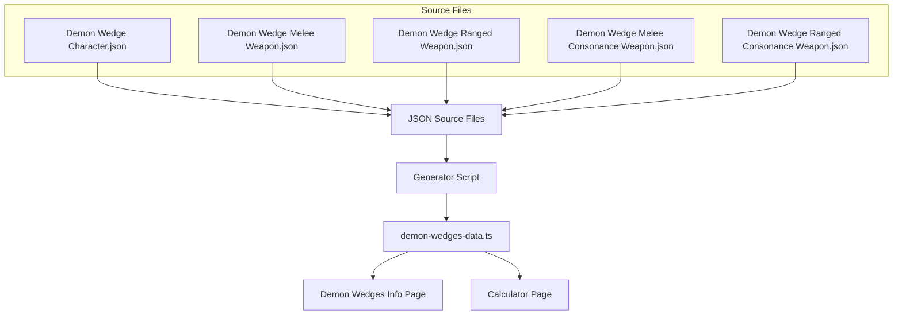

# Design Document

## Overview

ระบบนี้จะ sync ข้อมูล Demon Wedges จากไฟล์ JSON ใน `Info Demon Wedge/` folder ไปยังไฟล์ `src/lib/demon-wedges-data.ts` โดยใช้ script ในการ generate ข้อมูลใหม่ทั้งหมดจาก JSON files เพื่อให้ข้อมูลตรงกัน 100%

## Architecture



## Components and Interfaces

### 1. JSON Source Data Structure

แต่ละ Demon Wedge ใน JSON มีโครงสร้างดังนี้:

```typescript
interface SourceDemonWedge {
  id: string;                    // UUID ที่ unique
  name: string;                  // ชื่อเต็มของ wedge
  rarity: number;                // 2, 3, 4, หรือ 5
  tags: string;                  // tags สำหรับ search
  images: {
    main: string;                // URL รูปหลัก
    element: string | null;      // URL รูป element หรือ null
    polarity: string | null;     // URL รูป polarity หรือ null
  };
  tolerance: number;             // ค่า tolerance
  effect: string;                // effect description
  stats: {
    base: Record<string, string>; // stats พื้นฐาน
  };
}
```

### 2. Target Data Structure (demon-wedges-data.ts)

```typescript
interface DemonWedge {
  id: string;
  name: string;                  // ชื่อย่อ (ตัดส่วนหลัง - ออก)
  fullName: string;              // ชื่อเต็ม
  image: string;                 // URL รูปหลัก
  elementIcon?: string;          // URL รูป element
  trackIcon?: string;            // URL รูป polarity
  stats: DemonWedgeStat[];
  tolerance: number;
  track: number;                 // 0 = Normal, 1-4 = polarity type
  rarity: DemonWedgeRarity;
  type: DemonWedgeType;          // Circle, Diamond, Moon, Rhombus, Normal
  element?: DemonWedgeElement;   // Pyro, Hydro, etc.
  tags: string[];
  description?: string;
  category: DemonWedgeCategory;
  usage: DemonWedgeUsage;
  levels?: DemonWedgeLevel[];
}
```

### 3. Generator Script

Script ที่จะอ่าน JSON files และ generate TypeScript code:

**Location:** `scripts/generate-demon-wedges.ts`

**Functions:**
- `readJsonFiles()` - อ่านไฟล์ JSON ทั้ง 5 ไฟล์
- `parseElement(elementUrl)` - แปลง URL เป็น element type
- `parsePolarity(polarityUrl)` - แปลง URL เป็น polarity type และ track number
- `transformWedge(source, category)` - แปลงข้อมูลจาก JSON เป็น DemonWedge
- `generateTypeScript(wedges)` - สร้าง TypeScript code
- `main()` - orchestrate ทั้งหมด

## Data Models

### Element Mapping

| Element URL Pattern | Element Type |
|---------------------|--------------|
| `/elements/pyro.webp` | Pyro |
| `/elements/hydro.webp` | Hydro |
| `/elements/electro.webp` | Electro |
| `/elements/lumino.webp` | Lumino |
| `/elements/anemo.webp` | Anemo |
| `/elements/umbro.webp` | Umbro |
| `null` | undefined |

### Polarity Mapping

| Polarity URL Pattern | Type | Track |
|---------------------|------|-------|
| `/polarities/1.webp` | Circle | 1 |
| `/polarities/2.webp` | Diamond | 2 |
| `/polarities/3.webp` | Moon | 3 |
| `/polarities/4.webp` | Rhombus | 4 |
| `null` | Normal | 0 |

### Category Mapping

| JSON File | Category | Usage |
|-----------|----------|-------|
| Demon Wedge Character.json | character | Character |
| Demon Wedge Melee Weapon.json | melee-weapon | Weapon |
| Demon Wedge Ranged Weapon.json | ranged-weapon | Weapon |
| Demon Wedge Melee Consonance Weapon.json | melee-consonance | Consonance Weapon |
| Demon Wedge Ranged Consonance Weapon.json | ranged-consonance | Consonance Weapon |

## Error Handling

1. **Missing JSON File:** Script จะ throw error พร้อมระบุชื่อไฟล์ที่หายไป
2. **Invalid JSON Format:** Script จะ throw error พร้อม parse error message
3. **Missing Required Fields:** Script จะ log warning และใช้ default values
4. **Invalid Element/Polarity URL:** Script จะ log warning และ set เป็น undefined/Normal

## Testing Strategy

### 1. Unit Tests

- Test `parseElement()` function กับ URLs ต่างๆ
- Test `parsePolarity()` function กับ URLs ต่างๆ
- Test `transformWedge()` function กับ sample data

### 2. Integration Tests

- Test การอ่าน JSON files ทั้งหมด
- Test การ generate TypeScript output
- Test ว่า output compile ได้ถูกต้อง

### 3. Validation Tests

- ตรวจสอบว่าจำนวน wedges ใน output ตรงกับ JSON
- ตรวจสอบว่า ID ทุกตัวไม่ซ้ำกัน
- ตรวจสอบว่าทุก wedge มี required fields ครบ

### 4. Manual Verification

- เปรียบเทียบ sample wedges ระหว่าง JSON และ generated output
- ตรวจสอบการแสดงผลบนหน้า Demon Wedges Info
